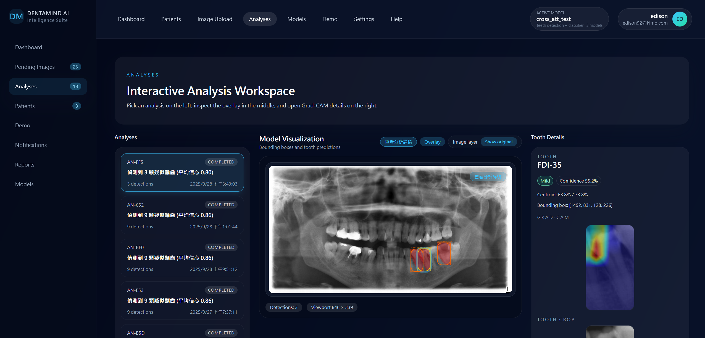
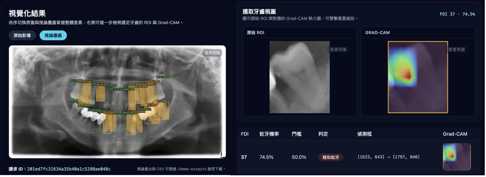

# Oral X-Ray Intelligence Platform

## 🌐 Language / 語言

- [English](#english)
- [中文](#中文)

---

## English

### 1. Overview

The Oral X-Ray Intelligence Platform combines a FastAPI backend, a Next.js 14 (App Router) frontend, and legacy PyTorch training utilities to streamline oral radiograph analysis. It offers interactive dashboards, simulated AI-assisted workflows, and clear extension points for future integrations.

### 2. Demo & Screenshots

<!-- 添加您的網頁截圖 -->


_Cross-attention Grad-CAM visualization for dental condition detection_

**📺 Demo Video**: [Watch the demo demonstration](https://youtu.be/ONw7fAoHVxE)

### 3. Repository Layout

```
teeth_project/
├── backend/                  # FastAPI application with sample in-memory data
│   ├── main.py                # REST endpoints and orchestration helpers
│   ├── schemas.py             # Pydantic domain models
│   └── requirements.txt       # Python dependencies for the API
├── frontend/                 # Next.js 14 (App Router) user interface
│   ├── app/                   # Dashboard, Patients, Upload, and Analysis Result pages
│   ├── components/            # Shared navigation, cards, widgets
│   ├── lib/                   # Typed API client utilities
│   └── package.json           # Frontend dependencies and scripts
├── docs/                     # System design documentation
├── models/                   # Saved model artifacts or checkpoints
├── src/                      # Legacy PyTorch training and inference scripts
└── data/                     # Sample datasets and supporting files
```

### 3. Prerequisites

| Component | Requirement                                         |
| --------- | --------------------------------------------------- |
| Backend   | Python 3.10+ and `pip`                              |
| Frontend  | Node.js 18+ and `npm` or `yarn`                     |
| Optional  | `make` or shell access for running combined scripts |

> **Tip:** Use a Python virtual environment to isolate dependencies and avoid conflicts with other projects.

### 4. Quick Start

1. **Clone the repository** (or open the project folder if already available).
2. **Create and activate a Python virtual environment:**
   ```bash
   python -m venv .venv
   source .venv/bin/activate  # Windows: .venv\Scripts\activate
   ```
3. **Install backend dependencies and start the API:**
   ```bash
   pip install -r backend/requirements.txt
   uvicorn backend.main:app --reload
   ```
   The API defaults to `http://localhost:8000` and serves mock data for immediate testing.
4. **Install frontend dependencies and start the web UI:**
   ```bash
   cd frontend
   npm install
   npm run dev
   ```
   Access the UI at `http://localhost:3000`. Ensure the backend remains running in a separate terminal.

### 5. Configuring the Frontend

Set the `NEXT_PUBLIC_API_BASE_URL` environment variable if the backend is hosted somewhere other than `http://localhost:8000`:

```bash
NEXT_PUBLIC_API_BASE_URL="https://your-api.example.com" npm run dev
```

### 6. Sample Workflow

1. Log in to the dashboard (no credentials required for the mock implementation).
2. Review the **Dashboard** page for system metrics, analysis queue status, and quick actions.
3. Open **Patients** to browse and search the mock patient registry. Select a patient to see demographics and history.
4. Navigate to **Upload** to drag-and-drop an oral radiograph image (placeholders are accepted). Provide patient/study details and submit to trigger the simulated pipeline.
5. View the generated report on the **Analysis Result** page, which displays detected conditions, AI findings, and a processing timeline.

### 7. API Reference (Development Mode)

| Endpoint                  | Method     | Description                                   |
| ------------------------- | ---------- | --------------------------------------------- |
| `/api/dashboard/overview` | GET        | System summary, queue status, recent patients |
| `/api/patients`           | GET / POST | List existing patients or create new entries  |
| `/api/analyses/{id}`      | GET        | Retrieve findings for a specific analysis     |
| `/api/images`             | POST       | Submit an image payload for processing        |
| `/api/analyses`           | POST       | Kick off a simulated analysis job             |

Responses return curated sample payloads that match the design specification, making it easy to develop the UI without real data sources.

### 8. Legacy Machine Learning Utilities

The original PyTorch scripts located in `src/` remain intact for researchers who need to train or evaluate models. Each script contains inline comments describing expected CSV/DICOM formats and configuration options.

### 10. Cross-Attention Demo

A lightweight FastAPI + Next.js experience is available to showcase the cross-attention Grad-CAM inference pipeline.


_Cross-attention demo interface with sample cases and upload functionality_

**🎬 Cross-Attention Demo Video**: [See the AI analysis in action](https://youtu.be/ONw7fAoHVxE)

- **Backend**: `demo_backend/main.py` exposes `/demo/samples` and `/demo/infer`. Configure weights via environment variables such as `DEMO_YOLO_WEIGHTS` and `DEMO_CLASSIFIER_WEIGHTS`.
- **Frontend**: visit `/demo` in the Next.js application to browse bundled cases or upload an image.
- **Static assets**: curated demo samples live in `demo_backend/static/samples/`; simply drop PNG/JPG files and the API will auto-discover them.
- **Outputs**: inference artifacts are stored under `demo_backend/outputs/` and surfaced through `/demo-outputs`.

### 9. Next Steps & Customization Ideas

- Replace in-memory stores with persistent databases and object storage.
- Connect the upload form to real file-handling services or presigned URLs.
- Integrate authentication/authorization (e.g., OAuth2 with RBAC) according to the design documentation.
- Extend the analytics pipeline to incorporate real inference results from the `models/` directory.

---

## 中文

### 1. 專案簡介

口腔 X 光智慧平台結合 FastAPI 後端、Next.js 14（App Router）前端以及既有的 PyTorch 訓練工具，提供完整的口腔放射影像分析體驗。系統內建互動式儀表板、模擬 AI 工作流程，並保留向真實服務整合的擴充彈性。

### 2. 示範與截圖

<!-- 添加您的網頁截圖 -->


_Cross-attention Grad-CAM 視覺化用於牙科疾病檢測_

**📺 示範影片**: [觀看完整平台演示](https://youtu.be/ONw7fAoHVxE)

### 3. 專案結構

```
teeth_project/
├── backend/                  # FastAPI 應用程式，提供內建測試資料
│   ├── main.py                # REST API 與流程協調工具
│   ├── schemas.py             # Pydantic 資料模型
│   └── requirements.txt       # 後端需要的 Python 套件
├── frontend/                 # Next.js 14（App Router）前端介面
│   ├── app/                   # 儀表板、病患、上傳、分析結果等頁面
│   ├── components/            # 共用導覽列、卡片、元件
│   ├── lib/                   # 型別化 API 呼叫工具
│   └── package.json           # 前端依賴與腳本
├── docs/                     # 系統設計文件
├── models/                   # 模型檔案或檢查點
├── src/                      # 傳統 PyTorch 訓練與推論腳本
└── data/                     # 範例資料集與相關檔案
```

### 3. 事前準備

| 組件 | 需求                                  |
| ---- | ------------------------------------- |
| 後端 | Python 3.10 以上與 `pip`              |
| 前端 | Node.js 18 以上與 `npm` 或 `yarn`     |
| 選用 | `make` 或終端機環境，用於執行整合腳本 |

> **小提示：** 建議使用 Python 虛擬環境隔離套件，避免與其他專案衝突。

### 4. 快速開始

1. **取得專案原始碼**（或直接在現有資料夾開啟）。
2. **建立並啟動 Python 虛擬環境：**
   ```bash
   python -m venv .venv
   source .venv/bin/activate  # Windows: .venv\Scripts\activate
   ```
3. **安裝後端套件並啟動 API：**
   ```bash
   pip install -r backend/requirements.txt
   uvicorn backend.main:app --reload
   ```
   API 預設使用 `http://localhost:8000`，並回傳模擬資料，方便立即測試。
4. **安裝前端套件並啟動開發伺服器：**
   ```bash
   cd frontend
   npm install
   npm run dev
   ```
   前往瀏覽器開啟 `http://localhost:3000`，請確保後端在另一個終端機持續運行。

### 5. 前端環境變數

若後端服務不在本機預設位置，可設定 `NEXT_PUBLIC_API_BASE_URL` 指向指定網址：

```bash
NEXT_PUBLIC_API_BASE_URL="https://your-api.example.com" npm run dev
```

### 6. 操作流程示例

1. 進入儀表板（目前為模擬環境，不需帳號密碼）。
2. 在 **Dashboard** 檢視系統統計、分析隊列與快捷操作。
3. 開啟 **Patients** 頁面瀏覽或搜尋病患名單，點選病患可查看詳細資料與歷史紀錄。
4. 前往 **Upload** 頁面拖曳上傳口腔 X 光影像（可使用範例檔案），填寫病患與檢查資訊後送出，觸發模擬流程。
5. 在 **Analysis Result** 頁面檢視系統產生的報告，包含檢測結果、AI 分析摘要與處理時間軸。

### 7. API 參考（開發模式）

| 路徑                      | 方法       | 說明                             |
| ------------------------- | ---------- | -------------------------------- |
| `/api/dashboard/overview` | GET        | 系統總覽、隊列狀態、最新病患資料 |
| `/api/patients`           | GET / POST | 取得病患列表或新增病患           |
| `/api/analyses/{id}`      | GET        | 取得特定分析的詳細結果           |
| `/api/images`             | POST       | 上傳影像資料以進行分析           |
| `/api/analyses`           | POST       | 建立模擬分析工作                 |

所有回應皆為設計文件對應的範例資料，可在無真實後端整合的情況下完成前端開發。

### 8. 傳統機器學習工具

`src/` 目錄保留原始的 PyTorch 腳本，適合持續進行模型訓練或評估的研究人員。每支腳本皆提供註解，說明所需的 CSV/DICOM 格式與設定方式。

### 9. 擴充方向與建議

- 將內建儲存改為真實資料庫與物件儲存服務。
- 在上傳流程中串接檔案上傳服務或使用預簽名網址。
- 依據設計文件導入身分驗證與權限管理（例如 OAuth2 + RBAC）。
- 將 `models/` 內的實際推論結果整合進分析流程。

### 10. Cross-Attention Demo 示範


_Cross-attention demo 介面展示樣本案例與上傳功能_

**🎬 Cross-Attention Demo 影片**: [觀看 AI 分析實際運作](https://youtu.be/ONw7fAoHVxE)

- **後端**：`demo_backend/main.py` 提供 `/demo/samples` 與 `/demo/infer` 端點，可透過 `DEMO_YOLO_WEIGHTS`、`DEMO_CLASSIFIER_WEIGHTS` 等環境變數指定模型權重。
- **前端**：在 Next.js 介面中開啟 `/demo` 頁面，即可瀏覽內建樣本或上傳影像查看推論與 Grad-CAM 疊層。
- **靜態資產**：示範影像放在 `demo_backend/static/samples/`，只要放入 PNG/JPG 檔即可自動出現在 Demo 頁面。
- **輸出檔案**：推論產物寫入 `demo_backend/outputs/`，並由 FastAPI 透過 `/demo-outputs` 提供靜態下載。
